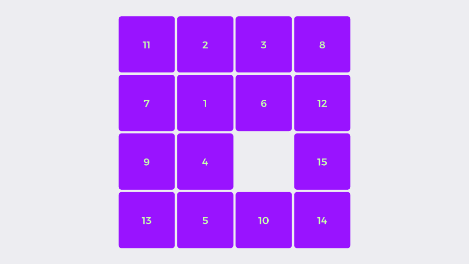

Fifteen Puzzle Game
===================

### Rearrange the pieces with as few moves as possible

**Instructions:**
1. In the "Shuffle moves" input, type how many moves you want the board to be shuffled with (any value between **1** and **80**).
2. Click on the "Shuffle" button and watch the pieces shuffling around.
3. Try rearranging the board with the same (or even fewer) number of moves than it was initially shuffled by clicking on the pieces with space to move. The pieces should be placed in ascending order from left to right, up to down.

### Development
- Clone this repository to your machine.
- Run `npm install` to install all the dependencies.
- Run `npm run start` to start the server and open `http://localhost:8080` on the browser. The site will reload automatically when changes in the source files are saved.

### Build

- Run `npm run build` to build the project. The built artifacts will be stored in the `dist/` directory.

### [Play the game](https://ofcode.com.br/projects/fifteen-puzzle-game)

Learn more about the [Fifteen Puzzle game on Wikipedia](https://en.wikipedia.org/wiki/15_puzzle).